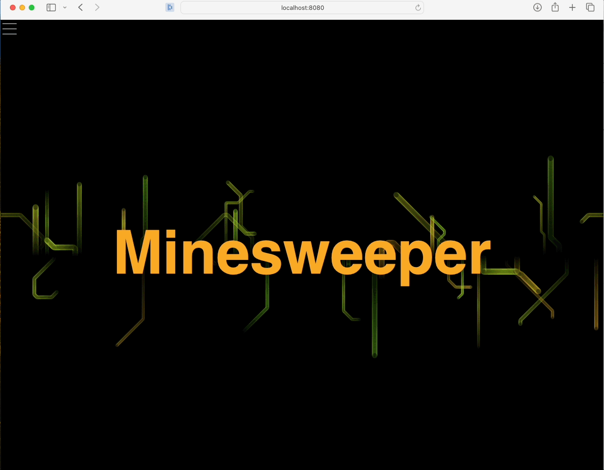

# Minesweeper
Discover the excitement of Minesweeper! Immerse yourself in an engaging web-based Minesweeper game, powered by Spring. It's an ideal choice for individuals who appreciate a combination of strategic thinking and enjoyment!



## 🚀 Features
- 🎮 Classic Gameplay: Immerse yourself in the timeless Minesweeper experience, reminiscent of nostalgic gaming moments.
- 🔊 Immersive Sound Effects**: Engaging audio effects intensify the experience, adding excitement to every move.
- 📏 Customize Your Challenge: Whether you're a Minesweeper beginner or a pro, choose the perfect game setting to match your skill level.
- ⏱️ Game Timer: Test your speed and agility with the in-game timer. Challenge yourself to beat your best time with each electrifying round.
- 💖 Lives: Strategize and make every move count! You start with 3 lives, and every wrong move costs you a life. The thrill intensifies as you strive to avoid the mines and outlast your opponents.
- 💾 Saved Games: Never lose your progress! Save your games and resume your epic Minesweeper journey at your convenience. The excitement continues from where you left off.
- 📱 Responsive Design: Seamlessly switch between devices and savor uninterrupted gameplay. Whether it's on your trusty desktop or your handheld device, the Minesweeper adventure never stops.
- 🔄 Reset Button: Never back down from a challenge! Hit the reset button and dive back into the action with just one click. The exhilarating adventure begins anew, ready to test your skills and wits once more!

- **Languages & Frameworks:** 
  - [](https://dev.java/)
  - [](https://spring.io/)
  - [](https://www.javascript.com/)
- **Database:**
  - [](https://www.mysql.com/)
- **ORM:**
  - [](https://hibernate.org/)
- **Template Engine**
  - [](https://www.thymeleaf.org/)
- **Web Technologies:** 
  - [](https://developer.mozilla.org/en-US/docs/Web/HTML)
  - [](https://developer.mozilla.org/en-US/docs/Web/CSS)
- **Build Tool:**
  - [](https://maven.apache.org/)

## 📝 Installation
1. **Clone the repository:**
   ```bash
   git clone https://github.com/seddonnguyen/minesweeper-spring.git
   ```
2. **Navigate to the project directory:**
   ```bash
   cd minesweeper-spring
   ```
3. **Build the project using Maven:**
   ```bash
   ./mvnw clean install
   ```
4. **Run the application:**
   ```bash
   ./mvnw spring-boot:run
   ```
5. **To Start the Game**: Simply open your web browser and go to http://localhost:8080 to kick off the fun!

## Gameplay Instructions
- **Objective**: Your mission is to clear the grid without setting off any mines.
- **Controls**: Left-click to reveal a cell and right-click to flag a mine.
- **Indicators**: Keep an eye on the numbers, they indicate how many mines are adjacent to a cell.
- **Winning**: Clear all non-mine cells to emerge as the victorious champion!
- **Adjust Settings**: Feel free to change the grid size and difficulty level using the settings menu for an even greater challenge.

## 🎮 Gameplay Tips
Here are some pro tips to take your game to the next level:
- **Plan Like a Pro**: Put those numbers to work! Use them to strategically deduce where the sneaky mines might be hiding.
- **Flag 'Em Down**: Channel your inner detective and mark potential mines with a slick right-click. This move will keep you from accidentally setting off an explosion!
- **Play it Safe**: Want to uncover those safe zones? Start with the corners or edges for a better shot at revealing larger safe areas. You've got this!

## Contributing
I'd love your help to improve the Minesweeper game! Whether it's bug fixes, new features, or enhancements, your contributions are incredibly valuable. Let's make Minesweeper even better together! Here’s how you can contribute:
1. **Fork the Repository**: Create a personal copy of the repository.
2. **Create a Branch**: Make a new branch for your changes.
   ```bash
   git checkout -b feature-branch
   ```
3. **Make Your Changes**: Implement your enhancements or fixes.
4. **Commit Your Changes**: Commit your changes with descriptive messages.
   ```bash
   git commit -m "Add feature"
   ```
5. **Push to Your Branch**: Push your changes to your repository.
   ```bash
   git push origin feature-branch
   ```
6. **Create a Pull Request**: Submit a pull request to the main repository for review.

## License
This project is licensed under the MIT License, making it free to use and modify. See the [LICENSE](https://github.com/seddonnguyen/minesweeper-spring/blob/main/LICENSE) file for details.

## Contact
Your engagement is important to me. Please feel free to reach out with any questions or feedback by opening an issue on the repository. Your input is highly valued.

Enjoy playing Minesweeper and happy coding!
